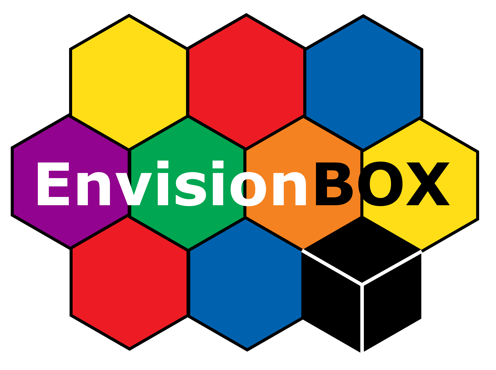

# Automatic Stimuli Creation for Degrading Visual Information about Articulation or Mouthing
 

Wim Pouw (wim.pouw@donders.ru.nl) & Annika Schiefner (a.schiefner@uva.nl)>

## Info documents

This script uses mediapipe to automatically and dynamically blur parts of the face, now specifically the mouth region. This can be helpful for stimuli generation in the application of sign languages but also spoken languages. See below for a description of this.

* location Repository:  https://github.com/WimPouw/StimuliCreationMaskingMouth.ipynb

* location Jupyter notebook: https://github.com/WimPouw/AutoVisualDegradArticulationMouthing/blob/main/StimuliCreationMaskingMouth.ipynb

Current Github: https://github.com/WimPouw/AutoVisualDegradArticulationMouthing

# Citations
* Pouw, W., & Schiefner, A. (2025). Masking the mouth region for visual degradation of articulation and mouthing (Version 1.0.0) [Software]. Retrieved from https://github.com/WimPouw/AutoVisualDegradArticulationMouthing

## Application for Sign langauages
In sign language research, psycholinguists often work with videos of individual signs, akin to working with single spoken words and gestures. These individual signs have different components, each contributing to the information conveyed by the lexical signs. This includes the hands, movements of the body and facial expressions and movements of the mouth.

Sign languages, existing in close proximity to hearing communities, often incorporate the movements associated with spoken words in the signs. When producing individual signs, signers may thus produce a mouth movement that looks as though they were saying the word alongside the hand movement. In fact, signers often find it difficult to produce signs with a neutral face and the resulting videos are perceived as less natural. This mean, in turn, that observers may be able to extract information about the lexical item from looking at the mouth, even without looking at the hands. If you want to investigate what information is conveyed by the manual movements without influence from what the mouth is contributing, you therefore need to mask the mouth area. This module provides an approach to doing that, blurring the area around the mouth such that lip reading becomes impossible.

Whenever the signers hands now move into the area around the mouth, you need to decide what to do with them. They can be covered by the same mask such that those parts of the hand that are close to the mouth are obscured as well or they can be excluded from the mask so the hand stays visible even around the mouth. As some handshapes are easier to identify and fit into a mask, e.g. a fist is a nice little circle and is therefore easy to track, while shaping the hand like a C leaves an opening between the fingers and the thumb which is more difficult to mask. Therefore, some portions of the mouth may still be visible with this option. The module provides different options, so you get to choose which one you prefer. Try and see for your own items and purpose what works best.

## Application for Spoken Languages
Perhaps you know the phenomenon of McGurk, where information about lip or tongue movements, i.e., articulatory gestures, influence the sounds you tend to hear. With this code you can easily adjust how much of such information is present.

## Use
Make sure to install all the packages in requirements.txt. Then move your videos that you want to mask into the input folder. Then run this code, which will loop through all the videos contained in the input folder; and saves all the results in the output folders.

Please use, improve and adapt as you see fit.

This python notebook runs you through the procedure of taking videos as inputs with a single person in the video, and outputting the 1 outputs of the kinematic timeseries, and optionally masking video with facial, hand, and arm kinematics ovelays.

## Additional information backbone of the tool (Mediapipe Holistic Tracking)
https://google.github.io/mediapipe/solutions/holistic.html

## Citation of mediapipe
citation: Lugaresi, C., Tang, J., Nash, H., McClanahan, C., Uboweja, E., Hays, M., ... & Grundmann, M. (2019). Mediapipe: A framework for building perception pipelines. arXiv preprint arXiv:1906.08172.

## Modification that is the basis of this tool
Our modification of the Mediapipe tool is using the coordinates of mediapipe to determine a region that we mask with a blur. We can change the coordinates for this bounding polygon if we want to blur other regions on the face. Please have a look below for more information about the keypoints.